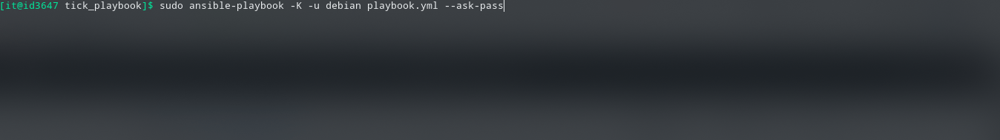
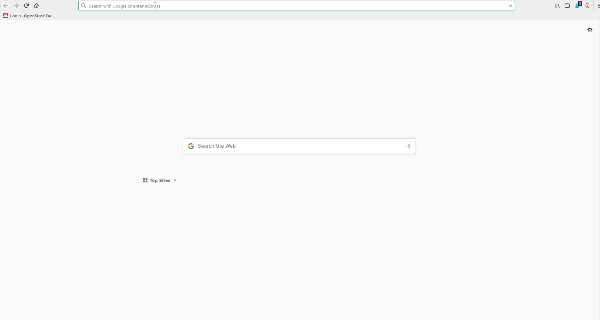

# TICK Stack + Grafana (Real-Time Monitoring)

Recorrendo à plataforma Influxdata e à ferramenta para visualização de dados Grafana, pretende-se,
com o presente projeto, implementar uma plataforma de monitorização de sistemas e dispositivos de rede, de forma a obter informações relativas ao seu estado de funcionamento, com o intuito de prevenir e solucionar problemas que ocorram na infraestrutura de rede.

## Getting Started

O conjunto de instruções que se seguem prevêm a instalação e configuração automática, recorrendo à ferramenta Ansible, de toda a plataforma de monitorização (TICK Stack (Telegraf, InfluxDB, Chronograf, Kapacitor) + Grafana), execuntando as diferentes instâncias da plataforma em containers Docker.

### Pré-Requisitos

- Para o correto funcionameto e instalação dos diferentes componentes, existe um conjunto de pacotes que devem estar presentes no terminal em cujas diferentes ferramentas serão executadas:

```
- apt-transport-https
- ca-certificates
- curl
- gnupg-agent
- software-properties-common
- python
- python-pip
- python-setuptools
- docker-ce
- docker-ce-cli
- containerd.io
- sshpass
```

### Estrutura de ficheiros

```
├── playbook.yml
├── telegraf.yml
├── enable_alerts.yml
├── hosts
├── roles
    └── telegraf
        └── files
            ├── telegraf.conf
        └── tasks
            ├── main.yml
        └── vars
            ├── main.yml
    └── alertas
        └── template
            ├── run_alertas.sh.j2
        └── tasks
            ├── main.yml
        └── tickscripts
            ├── cpu_usage_system_stream.tick
            ├── cpu_usage_user_stream.tick
            ├── dead_cpu.tick
            ├── disk_use_stream.tick
            ├── mem_used_stream.tick
            ├── net_bytes_recived_stream.tick
            ├── net_bytes_sent_stream.tick
            ├── system_dead_deadman.tick
        └── vars
            ├── main.yml
    └── influxdb
        └── files
            ├── influxdb.conf
        └── tasks
            ├── main.yml
        └── vars
            ├── main.yml
    └── chronograf
        └── tasks
            ├── main.yml
        └── canned
            ├── complete_dashboard.json
            ├── simpledashboard.json
    └── chronograf_dsahboard_deploy
        └── dashboards
            ├── complete_dashboard.json.j2
            ├── simple_dashboards.json.j2
            ├── teste.json.j2
        └── tasks
            ├── main.yml
        └── template
            ├── import_dashboard.sh.j2
        └── vars
            ├── main.yml
    └── kapacitor
        └── files
            ├── kapacitor.conf
        └── tasks
            ├── main.yml
        └── templates
            ├── kapacitor.conf.j2
    └── grafana
        └── files
            ├── dashboard.yaml
            ├── grafana.ini
            └── GRAFANA_DASHBOARDS
                ├── CPU Statistics-1555349260797.json
                ├── Disk Usage and I_O-1555349247338.json
                ├── Network Overview-1555349238507.json
                ├── RAM Statistics-1555349253674.json
                ├── System Overview-1555349229812.json
        └── tasks
            ├── main.yml
    └── dependencies
        └── tasks
            ├── main.yml
```

### Instalação

1- Efetuar o clone do repositório do github que contêm os ficheiros:
```
$git clone https://github.com/hfrpinto/tick_playbook.git
$cd tick_playbook
```


2- Executar o playbook (playbook.yml) e introduzir o endereço ip do host de destino:
```
$ sudo ansible-playbook -u [username do host de destino] playbook.yml --ask-pass
```



3- Escolher uma das opções no menu apresentado:


4- Mediante a escolha selecionada, serão instaladas as ferramentas pretendidas:


A instalação do agente Telegraf é necessária, sendo que a instalação do mesmo se encontra definida num playbook em separado, tendo em conta que o mesmo poderá ser este instaldo na mesma máquina ou em terminais separados.

1- Executar o playbook (telegraf.yml) e introduzir o/s endereço/s ip do/s host/s de destino:
(caso se pretenda instalar em várias máquinas em simultâneo, os endereços ip introduzidos deverão ser separados por vírgulas. Ex.: 192.168.1.1,192.168.1.2)
```
$sudo ansible-playbook -u [username do host de destino] telegraf.yml --ask-pass
```


2 - Introduzir o endereço ip do InfluxDB no qual serão armazenados os dados coletados:


3- Aguardar a conclusão da instalação.


### Configuração plataforma Grafana/Chronograf

Após efetuada a instalação dos diferentes componentes pretendidos, é necessária efetuar a configuração das ferramentas de visualização de dados, mediante os que foram escolhidos (ambos ou apenas um deles).

#### Grafana

1- Aceder no browser à página inicial do Grafana. Para aceder à página, deverá introduzir o endereço ip da máquina na qual este se encontra instalado, seguido da porta de acesso (porta 3000 por defeito) e efetuar login com as credênciais de administrador:
```
username: admin
password: admin
```


2- Configurar a fonte dos dados (data source). Para este caso em específico o tipo de data source a selecionar será o InfluxDB, no qual serão configurados o ip da máquina em que se encontra o influxdb instalado, o nome da base de dados bem como o utilizador e a password correspondentes:
```
HTTP URL: http://[endereço ip influxdb):8086
Database: db0 (definido por defeito, podendo ser alterados no ficheiro ./tick_playbook/roles/influxdb/vars/main.yml)
User: telegraf (definido por defeito, podendo ser alterados no ficheiro ./tick_playbook/roles/influxdb/vars/main.yml)
Password: telegraf (definido por defeito, podendo ser alterados no ficheiro ./tick_playbook/roles/influxdb/vars/main.yml)
```


3- Aceder à aba Dashboards para visualização dos dados coletados. Com a instalação do Grafana são importadas um conjunto de dashboards padrão, previamente configuradas e implementadas no momento da instalação.


#### Chronograf

1- Aceder no browser à página inicial do Chronograf. Para aceder à página, deverá introduzir o endereço ip da máquina na qual este se encontra instalado, seguido da porta de acesso (porta 8888 por defeito). Contrariamente ao Grafana este não requere a autenticação do utilizador, podendo porém serem criados posteriormente utilizadores com diferentes permissões.



2- Verificar as configurações do data source (influxdb) e do agente responsável pelos alertas (kapacitor):
```
Esta configuração é definida através de variáveis na configuração da plataforma.
```

|[](chrchono_config.gif)

3- Aceder ás dashboards. Verificar os scripts de alerta. (Assim como no Grafana, as dashboards e os scripts de alerta do Chronograf, são importados no momento da instalação, mediante parâmetros previamente configurados)


## Built With

* [Docker](https://docs.docker.com/)
* [Ansible](https://docs.ansible.com/)
* [Influxdata](https://docs.influxdata.com/)
