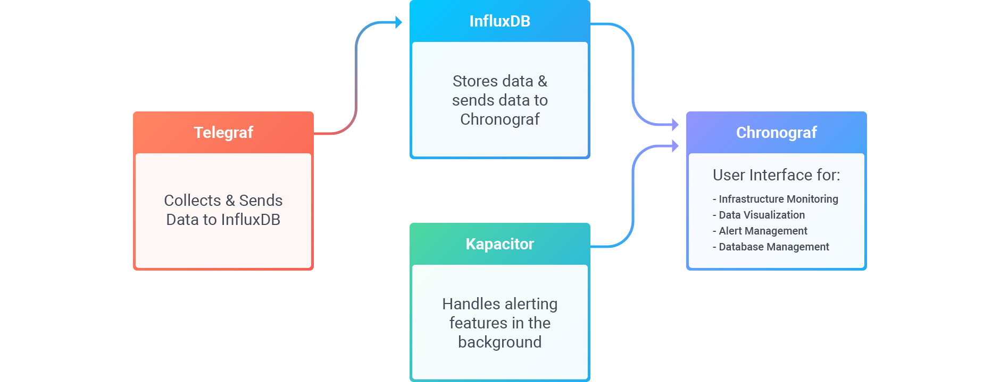
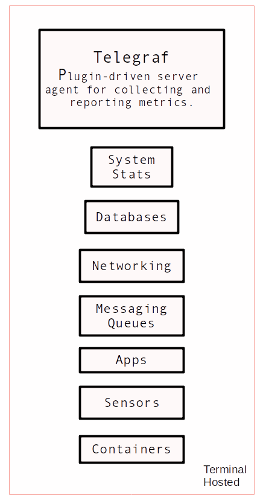
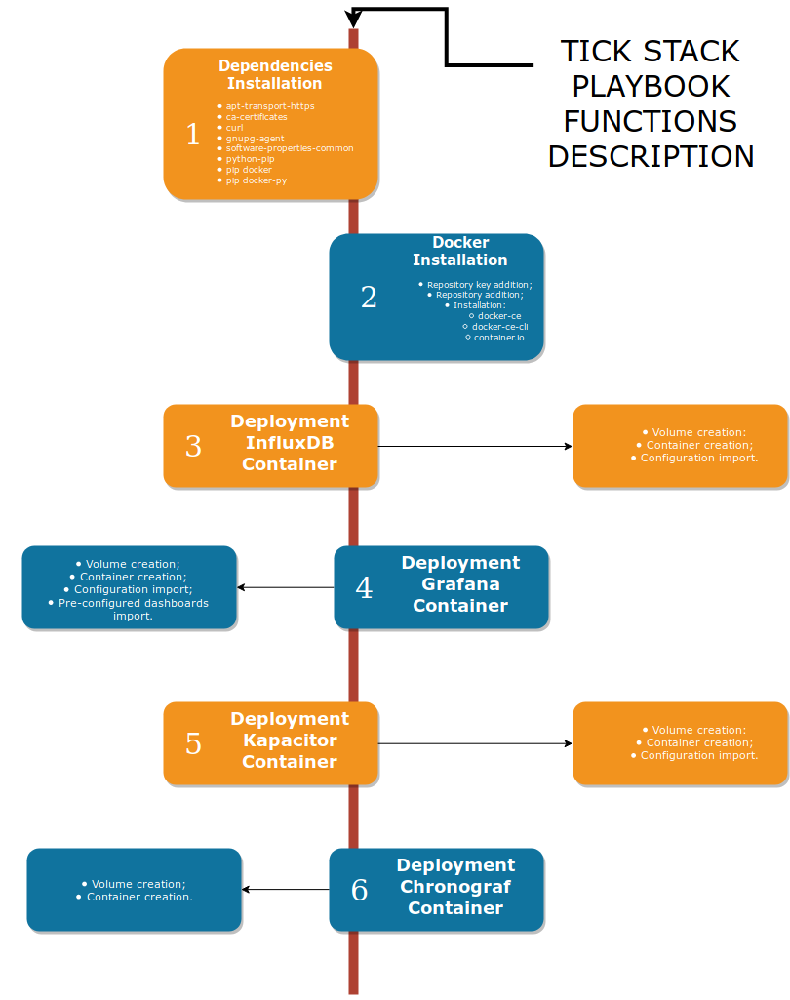

## **Introduction**

The purpose of this service description document is to provide a detailed description of the TICK Stack service, realized by using the Influxdata technology. It describes a well-defined baseline of the service and it's implementation.
The aim is to document the key aspects of the TICK Stack service technical design. This Includes:

- overview of the Influxdata platform (TICK STACK):
  - Telegraf;
  - InfluxDB;
  - Chronograf;
  - Kapacitor.
- detailed description about telegrafs agents and input plugins:
  - mapping of network interfaces;
  - mapping of cpu cores;
  - mapping of storage devices;
  - mapping of snmp enabled devices.
- detailed description of the data analysis dashboards:
  - variables, drilldowns and alerts.

## **Influxdata Overview**

{:height="50%" width="50%"}

Influxdata is a time series data platform built to integrate real-time analytics, event handling and time-based data with Open Source plugins.
A time series database deals with specific workloads and requirements. They need to ingest millions of data points per second, performing real-time queries across these large data sets in a non-blocking manner, downsampling and evicting high-precision low-value data. It optimizes data storage, reducing its costs and performing complex time-bound queries to extract meaningful insight from the data.
Influxdata is a complete platform for handling all time series data, from humans, sensors or machines - seamlessly collecting, storing, visualizing and turning insight into action. With both fast deployment and fast performance, Influxdata delivers real value in real time.

## **TICK Stack - Telegraf**

Telegraf is part of the TICK Stack and is a plugin-driven server agent for collecting and reporting metrics. Telegraf has integrations to source a variety of metrics, events and logs, directly from the containers and systems it's running on, pull metrics from third-party APIs, or even listen for metrics via a snmp service. It also has output plugins to send metrics to a variety of other datastores, services and message queues, including InfluxDB.

